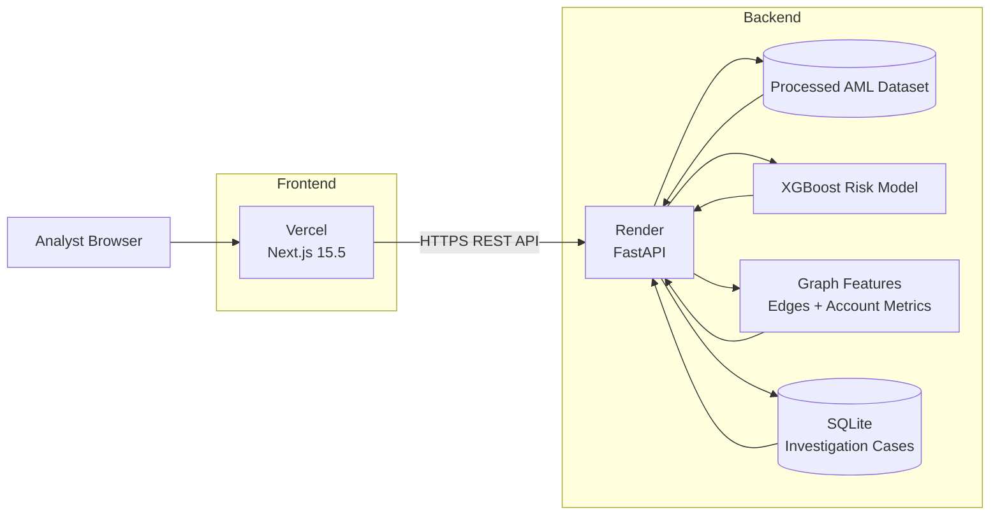
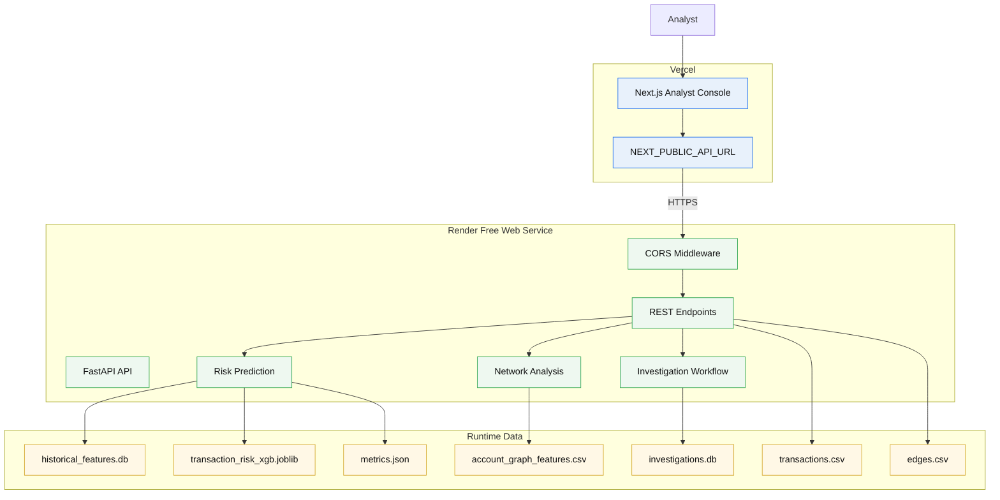
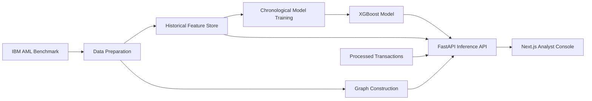

# AML Insight

AML Insight is a transaction-network analysis platform for anti-money-laundering investigations. It combines transaction-level machine learning, graph analytics, suspicious-pattern detection, explainable risk scoring, and an analyst-focused investigation workflow.

[](https://aml-insight-ebon.vercel.app)
[](https://aml-insight-api.onrender.com)

## Live Demo

**Application:** https://aml-insight-ebon.vercel.app

**API:** https://aml-insight-api.onrender.com

The public demo uses a lightweight deployment dataset derived from the IBM AML benchmark so the free hosting environment remains small. The deployed demo currently exposes 79 transactions, 48 suspicious transactions, 8 network nodes, and a trained XGBoost risk model.

> The full IBM HI-Small dataset is not committed to this repository.

## Application Overview

AML Insight is organized around the analyst workflow:

1. **Overview** — command-center metrics, suspicious relationship map, model status, and priority alerts.
2. **Transactions** — transaction exploration and filtering.
3. **Predict** — transaction-level risk prediction with model-derived feature contributions.
4. **Network** — account relationship analysis and connected-account investigation.
5. **Alerts** — suspicious transaction review.
6. **Investigations** — persistent case creation, evidence, timeline, connected accounts, status/resolution workflow, metrics, and CSV export.
7. **Models** — model status and evaluation metrics.

## Application Architecture

The deployed application separates the browser UI from the API and keeps the data/model layer behind the API.



### Deployment architecture

| Layer | Technology | Responsibility |
|---|---|---|
| Analyst UI | Next.js / React | Dashboard, transactions, alerts, network investigation, prediction, cases, model views |
| Web hosting | Vercel | Builds and serves the Next.js application |
| API | FastAPI / Python | REST endpoints, feature retrieval, prediction, network analysis, investigation workflow |
| API hosting | Render | Runs the Dockerized FastAPI service |
| Transaction data | CSV | Lightweight processed transaction dataset used by the public demo |
| Feature store | SQLite | Historical transaction features used for prediction |
| Graph data | CSV | Account relationships and graph metrics |
| Risk model | XGBoost | Transaction risk prediction |
| Case store | SQLite | Investigation cases, evidence, timeline, and case state |

## Technical Architecture Diagram (TAD)

The following TAD shows the main runtime components and the data flow between them.



## Data and ML Flow



The baseline model uses leakage-safe historical features and chronological train/validation/test evaluation. The deployed model exposes the same inference contract through the FastAPI service.

## UI Walkthrough

The public application contains the following analyst-facing pages:

| Page | Purpose | Live view |
|---|---|---|
| Overview | Command center with transaction count, alerts, suspicious volume, network size, model state, and priority queue | [Open Overview](https://aml-insight-ebon.vercel.app/) |
| Transactions | Explore transaction records and suspicious activity | [Open Transactions](https://aml-insight-ebon.vercel.app/transactions) |
| Predict | Score an individual transaction and inspect model-derived risk contributions | [Open Predict](https://aml-insight-ebon.vercel.app/predict) |
| Network | Investigate an account and its connected relationships | [Open Network](https://aml-insight-ebon.vercel.app/network) |
| Alerts | Review suspicious transaction alerts and risk signals | [Open Alerts](https://aml-insight-ebon.vercel.app/alerts) |
| Investigations | Create and manage investigation cases, evidence, timeline, connected accounts, and exports | [Open Investigations](https://aml-insight-ebon.vercel.app/investigations) |
| Models | Inspect the deployed model state and evaluation metrics | [Open Models](https://aml-insight-ebon.vercel.app/models) |

### Network investigation

The Network page provides account-centric investigation. The deployed demo opens on account `811C599A0`, which has 79 transactions, 48 suspicious transactions, 7 counterparties, and connected graph relationships.

### Investigation command center

The Overview page combines the highest-value analyst signals in one place: transaction volume, suspicious activity, risk volume, network size, model state, and a priority alert queue.

### Investigation workflow

The Investigations page supports creating a case, reviewing account activity, attaching evidence, maintaining a timeline, linking connected accounts, changing case status/resolution, viewing case metrics, and exporting the case as CSV.

> UI screenshots can be stored under `docs/screenshots/` and embedded here as they are captured from the live deployment. The live links above always point to the current deployed UI.

## Data

The project is designed around IBM's synthetic AML benchmark. The full dataset is not committed to this repository.

For local benchmark work, download `HI-Small_Trans.csv` separately and place it under `data/raw/`.

IBM states that the data is synthetic and includes a laundering label for transactions. The source dataset is released under CDLA-Sharing-1.0.

Source: https://github.com/IBM/AML-Data

## Repository Architecture

- `apps/web`: Next.js analyst console
- `services/api`: FastAPI service
- `ml`: model training and inference code
- `scripts`: data preparation, validation, and graph utilities
- `data`: local dataset and generated artifacts
- `models`: trained model and evaluation metadata
- `docs`: benchmark and project documentation

## Local Development

### Generate local demo data

```bash
python scripts/generate_demo_data.py
python scripts/prepare_data.py
python scripts/build_graph.py
```

### Validate and prepare the IBM benchmark

```bash
python scripts/validate_dataset.py
python scripts/prepare_benchmark.py
python scripts/build_historical_features.py
python ml/train_baseline.py
python scripts/score_typologies.py
```

### Frontend

```bash
cd apps/web
npm install
npm run dev
```

### Backend

```bash
cd services/api
python3 -m venv .venv
source .venv/bin/activate
pip install -r requirements.txt
uvicorn app.main:app --reload --port 8000
```

Open `http://localhost:3000` for the command center and `http://localhost:3000/transactions` for the transaction explorer.

For local frontend-to-API communication, set:

```text
NEXT_PUBLIC_API_URL=http://localhost:8000
```

## API Health

The deployed API exposes a health endpoint:

https://aml-insight-api.onrender.com/health

The API also exposes overview, transactions, alerts, prediction, network, account, model, and investigation endpoints under `/api/v1/`.

## Deployment

### Frontend — Vercel

- Root directory: `apps/web`
- Framework: Next.js
- Build command: `npm run build`
- Environment variable: `NEXT_PUBLIC_API_URL=https://aml-insight-api.onrender.com`

### Backend — Render

- Service: Dockerized FastAPI
- Dockerfile: `services/api/Dockerfile`
- Health check: `/health`
- CORS configuration: `CORS_ORIGINS`
- Public API: https://aml-insight-api.onrender.com

## Current Deployment Dataset

The free public deployment intentionally uses a compact subset of the benchmark data:

| Metric | Value |
|---|---:|
| Transactions | 79 |
| Suspicious transactions | 48 |
| Network nodes | 8 |
| Primary investigation account | `811C599A0` |
| Counterparties for primary account | 7 |
| Model | XGBoost |
| Frontend | Vercel |
| Backend | Render |

This keeps the public demo suitable for free hosting while preserving the end-to-end investigation workflow.

## Model Evaluation

The deployed model metadata reports chronological train/validation/test evaluation with threshold selection on the validation set.

The public API exposes the stored evaluation metadata through:

```text
GET /api/v1/model
GET /api/v1/overview
```

The reported benchmark metrics are from the trained model evaluation and should not be interpreted as metrics computed from the reduced 79-transaction deployment subset.

## Planned Milestones

1. IBM HI-Small benchmark ingestion and profiling
2. Temporal leakage-safe model evaluation
3. AML typology/rule engine
4. Interactive graph investigation
5. GraphSAGE/GAT/RGCN comparison
6. Explainable risk scoring
7. Investigation cases and audit trail
8. PostgreSQL persistence and production deployment

## License and Dataset Notice

The application code in this repository and the IBM benchmark dataset have separate licensing considerations. Refer to the IBM AML-Data repository for the dataset terms before redistributing the benchmark data.

## Author

**Abhijeet Kumar**

GitHub: https://github.com/Abhijeet-035
